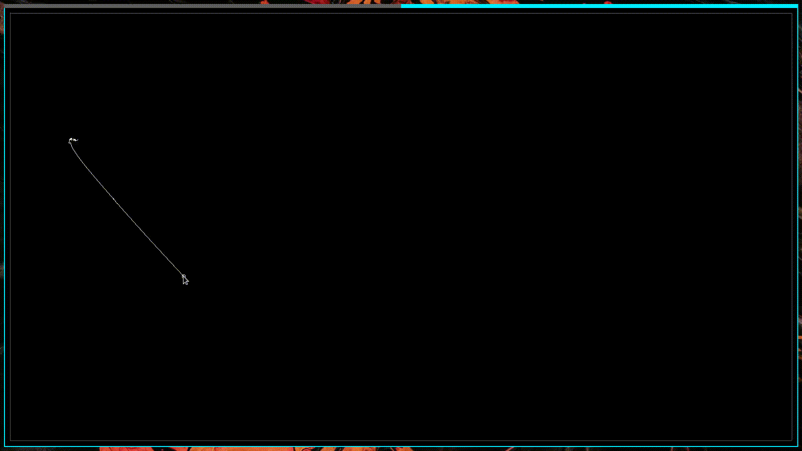

# Verlet in Zig

A small application demonstrating how Verlet Integration works. I wrote this before in C, but this version has a much more accurate simulation. Also, this version uses my personal SDL2 library ([lsdl-zig](./lib/lsdl-zig/readme.md)). That library was developed alongside this project. 

This version uses a more exact derivation of Verlet Integration, which tolerates non-constant time differences. See [here](https://en.wikipedia.org/wiki/Verlet_integration#Non-constant_time_differences) for more information. Currently, the project is undocumented, but I plan to document it so that it's easier to understand.